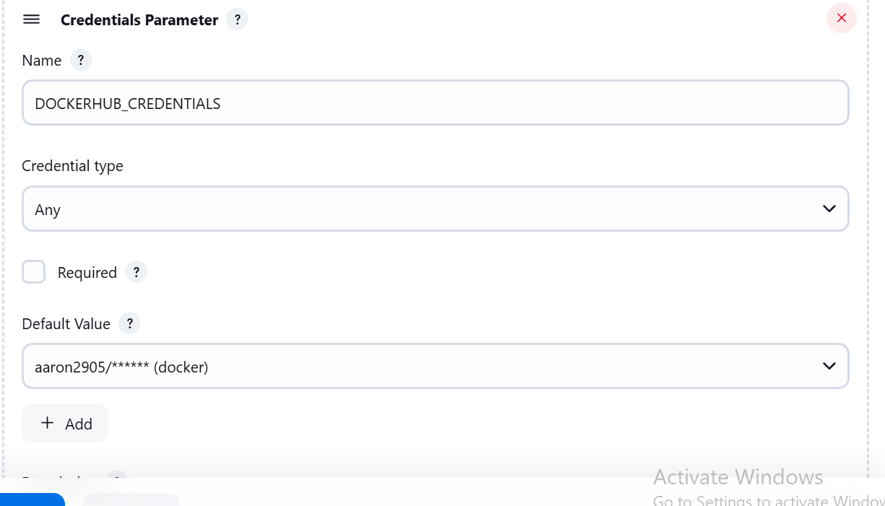
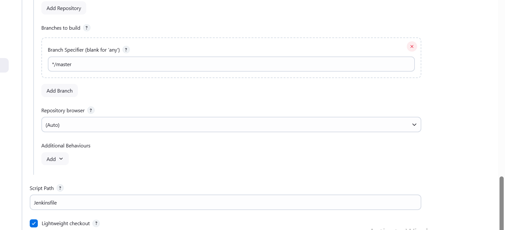

# Sentiment App

# This a full stack App for detecting the sentiment of the notes content

# PreRequisities
1) Install nodejs
2) Install docker or docker desktop
3) Install jenkins

# This app has 2 sections
1) Frontend which is developed in React
2) Backend which is developed in Nodejs and Expressjs

# To run this app in local
1) We can clone the repo using git clone https://github.com/Aaron-Joel-Fernandes/notesentiment.git
2) Add the project to workspace in Visual studio
3) Open 2 terminals
4) In one terminal navigate using `cd ./frontend` and give the command `npm run start`
5) In other terminal navigate using `cd ./backend` and give the command `npm run start`

# To run the app deployed on dockerhub via the cicd pipleine
1) Navigate to docker-compose.yaml
2) Run `docker-compose up -d`

# To run the ci/cd pipline
1) Install Jenkins
2) Start Docker Hub and run the docker engine
3) Create a pipleine in jenkins following below images

4) Run the pipeline

# Testing the app
1) Register the user after starting the App
2) Login in the App
3) Create notes
4) Analyze sentiment of the notes made